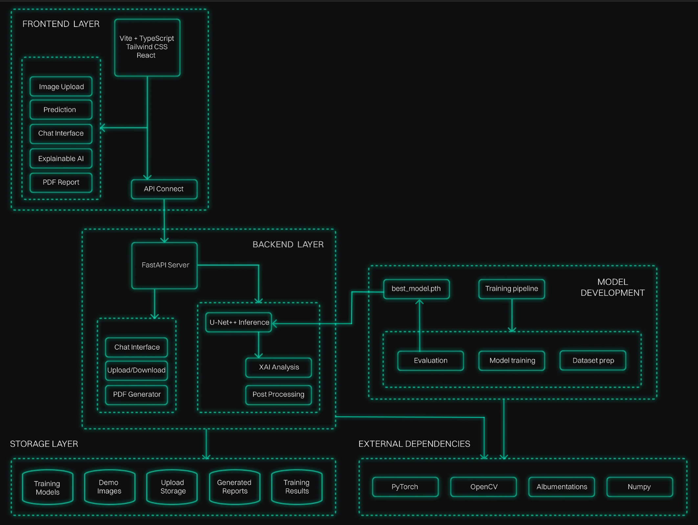

# Uterine Fibroids Analyzer Web Application

## Contents

1. [Introduction](#1-introduction)
2. [Demo Video](#2-demo-video)
3. [Model Summary](#3-model-summary)
4. [Features](#4-features)
5. [Architecture Diagram](#5-architecture-diagram)
6. [Tech Stack](#6-tech-stack)
7. [Project Structure](#7-project-structure)
8. [How to Run the App](#8-how-to-run-the-app)
9. [Difficulties Faced](#9-challenges-i-faced)
10. [Future Improvements](#10-future-improvements)

---

## 1. Introduction

The Uterine Fibroids Analyzer is an AI-powered medical imaging web application that assists healthcare professionals and patients in detecting and analyzing uterine fibroids from ultrasound images. The system combines advanced deep learning techniques(U-Net++, Efficient B5-encoder) with explainable AI(GradCam, Integrated Gradients) to provide accurate segmentation results and interpretable insights through an intuitive web interface(React, FastAPI).

---

## 2. Demo Video

<!-- Demo video will be added here -->
[*Demo video placeholder - to be added*](https://github.com/user-attachments/assets/4d66e188-83c9-4e66-bdfe-1b4e3d62f1de)

---

## 3. Model Summary

### U-Net++ Architecture with EfficientNet-B5 Encoder

The core AI model is a U-Net++ architecture with EfficientNet-B5 encoder, specifically trained for uterine fibroid segmentation from ultrasound images.

**Key Performance Metrics:**
- **Dice Score**: 0.8944 (89.44% segmentation accuracy)
- **IoU (Intersection over Union)**: 0.8135 (81.35% overlap accuracy)
- **Pixel Accuracy**: 99.72% (overall pixel classification accuracy)
- **Sensitivity**: 89.11% (true positive rate for fibroid detection)
- **Specificity**: 99.90% (true negative rate for healthy tissue)
- **Precision**: 91.00% (positive predictive value)


For detailed model training results, architecture details, and comprehensive evaluation metrics, see: [UNET-model/README.md](UNET-model/README.md)

---

## 4. Features

### **Doctor Interface**
- **Image Upload & Analysis**: Secure upload of patient ultrasound images with real-time AI-powered segmentation
- **U-Net++ Segmentation**: State-of-the-art deep learning model for precise fibroid detection and boundary delineation
- **Explainable AI (XAI)**: 
  - **GradCAM Analysis**: Visual attention heatmaps showing model focus areas
  - **Integrated Gradients**: Pixel-level attribution maps for detailed interpretability
- **Comprehensive Analytics**: Detailed metrics including Dice score, IoU, sensitivity, specificity, and precision
- **PDF Report Generation**: Professional medical reports with patient data, analysis results, and XAI visualizations
- **Clinical Notes**: Add personalized observations and recommendations to reports
- **Real-time Processing**: Asynchronous analysis with progress tracking and status updates

### **Patient Interface**
- **User-Friendly Upload**: Simplified interface for personal ultrasound scan uploads
- **AI Health Chatbot**: Intelligent conversational assistant powered by Gemini AI for health guidance
- **Interactive Questionnaire**: Comprehensive health assessment with dynamic question flow
- **Personalized Reports**: Easy-to-understand analysis results with visual explanations
- **Health Consultation**: Get answers to fibroid-related questions and lifestyle recommendations

### **Technical Features**
- **Asynchronous Processing**: Non-blocking AI inference with polling-based status updates
- **Progress Tracking**: Real-time progress indicators for all analysis stages
- **Error Handling**: Robust error management with graceful fallbacks
- **Modern UI/UX**: Clean, intuitive interface with smooth animations and transitions

---

## 5. Architecture Diagram

<!-- Architecture diagram will be added here -->


---

## 6. Tech Stack

### **Frontend**
- React 18
- TypeScript
- Vite
- Tailwind CSS
- Framer Motion
- Axios

### **Backend**
- Python 3.11
- FastAPI
- PyTorch
- Segmentation Models PyTorch
- PyTorch GradCAM
- OpenCV
- NumPy
- Matplotlib
- ReportLab
- Google Gemini AI

### **AI/ML Stack**
- U-Net++
- EfficientNet-B5
- Albumentations
- GradCAM & GradCAM++
- Integrated Gradients

### **Development Tools**
- npm/pip
- Uvicorn
- Git

---

## 7. Project Structure

```
UT_webapp 2/
├── frontend/                    # React TypeScript frontend
│   ├── src/
│   │   ├── components/         
│   │   │   ├── ImageUpload.tsx     
│   │   │   ├── PredictionViewer.tsx 
│   │   │   ├── GradCAMSlideshow.tsx 
│   │   │   ├── PatientInterface.tsx 
│   │   │   ├── DoctorInterface.tsx 
│   │   │   └── ChatInterface.tsx    
│   │   ├── utils/
│   │   │   └── api.ts              # API communication layer
│   │   ├── types/
│   │   │   └── index.ts           
│   │   └── App.tsx                 
│   ├── package.json
│   └── vite.config.ts            
│
├── backend/                     # FastAPI Python backend
│   ├── models/                  # AI model implementations
│   │   ├── unet_inference.py       # U-Net segmentation engine
│   │   ├── xai_analysis.py         # XAI analysis coordinator
│   │   ├── gradcam_unet.py         # GradCAM implementation
│   │   └── integrated_gradients.py # Integrated Gradients implementation
│   ├── services/               
│   │   └── chatbot_service.py      # Gemini AI chatbot service
│   ├── utils/                  
│   │   └── pdf_generator.py        # PDF report generation
│   ├── main.py                     # FastAPI application entry point
│   └── requirements.txt           
│
├── UNET-model/                  # Model training and utilities
│   ├── utils/                   
│   │   ├── dataset.py              
│   │   ├── enhanced_dataloader.py  
│   │   └── metrics.py              
│   ├── train_unetpp.py            
│   ├── predict.py                
│   └── predict_and_overlay.py    
│
├── models_20250609_105424/      # Trained model weights
│   └── best_model.pth             # Best performing model checkpoint
│
└── README.md                      
```

---

## 8. How to Run the App

### **Prerequisites**
- Python 3.11 or higher
- Node.js 18 or higher
- At least 4GB RAM (for model inference)
- Modern web browser (Chrome, Firefox, Safari, Edge)

### **Step 1: Clone the Repository**
```bash
git clone https://github.com/srishhhhx/Grad-cam.git
cd UT_webapp\ 2
```

### **Step 2: Backend Setup**
```bash
# Navigate to backend directory
cd backend

# Create virtual environment (recommended)
python -m venv venv
source venv/bin/activate  # On Windows: venv\Scripts\activate

# Install Python dependencies
pip install -r requirements.txt

# Set up environment variables (optional)
cp .env.example .env  # Configure Gemini API key if using chatbot
```

### **Step 3: Frontend Setup**
```bash
# Navigate to frontend directory (from project root)
cd frontend

# Install Node.js dependencies
npm install
```

### **Step 4: Start the Application**

**Terminal 1 - Backend Server:**
```bash
cd backend
python main.py
# Server will start at http://localhost:8000
```

**Terminal 2 - Frontend Development Server:**
```bash
cd frontend
npm run dev
# Application will open at http://localhost:3000
```
### **Step 5 : Download the Unet model from the provided link and replace it with the best_model.pth**:

Download the model from here: https://drive.google.com/file/d/1iGERcpQW3reazoFDjXG-QJnLMYNmoHAP/view?usp=sharing


### **Step 6: Access the Application**
- Open your browser and navigate to `http://localhost:3000`
- Choose **Doctor Interface** for clinical analysis
- Choose **Patient Interface** for patient-focused experience
- Upload an ultrasound image to begin analysis

### **API Documentation**
- FastAPI auto-generated docs: `http://localhost:8000/docs`
- Alternative docs: `http://localhost:8000/redoc`

---

## 9. Challenges I Faced

Building this application involved several key technical challenges, from deep learning theory to robust software architecture.

#### **Bridging Theory and Practice**: 
Moving beyond standard libraries, a deep dive into academic papers was essential to correctly implement U-Net++'s dense skip connections and adapt XAI methods for our specific segmentation task. 

#### **Navigating the Hyperparameter Maze**: 
Achieving an 89.4% Dice Score required a rigorous hyperparameter tuning process, systematically balancing learning rates and loss functions to maximize segmentation accuracy while preventing overfitting.

#### **Architecting a Scalable Backend API**: 
We engineered a clean, RESTful API in FastAPI to manage complex, asynchronous workflows. The design ensures flawless communication from initial upload and status polling to the final delivery of analysis results.

#### **Achieving a Non-Blocking UI**: 
To prevent the UI from freezing during heavy AI inference, we implemented an asynchronous, polling-based backend. This lets the model process in the background, providing users with real-time progress updates for a responsive experience. 

---

## 10. Future Improvements

#### **Enhanced Diagnostic Insight:** 
Evolve the model to perform multi-class segmentation (differentiating fibroid types) and analyze complex 3D ultrasound and MRI scans.

#### **Temporal Progression Monitoring:** 
Introduce a feature to automatically compare a patient's scans over time, tracking fibroid growth or shrinkage and providing predictive insights. 

#### **Accelerated AI Inference:** 
Drastically reduce analysis time by implementing GPU support (CUDA) and model quantization, making real-time diagnosis feasible.

#### **Deepening Clinical Integration:** 
Natively support core medical imaging standards (DICOM) to integrate directly with hospital Picture Archiving and Communication Systems (PACS).